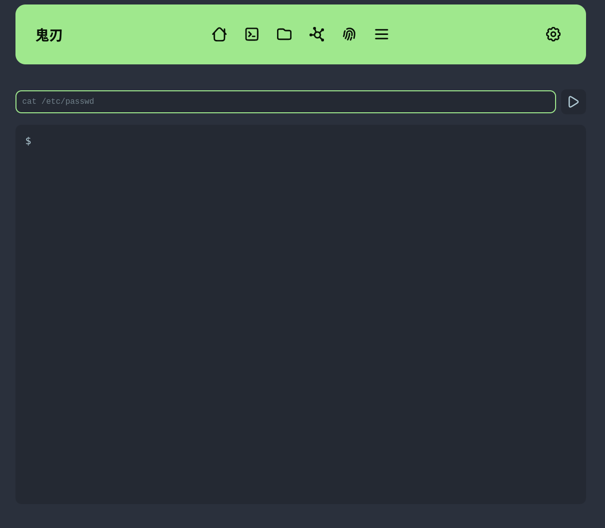
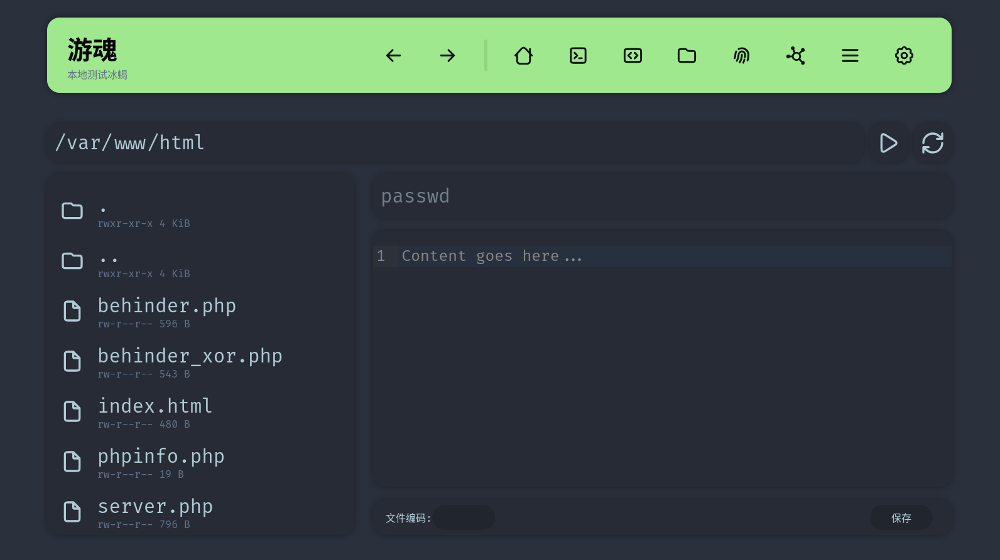

# 游魂

游魂是一个开源的Webshell管理器，提供更为方便的界面和功能，可配合或代替其他webshell管理器，帮助用户在各类渗透场景中控制目标机器。

游魂不仅支持常见的一句话webshell以及常见Webshell管理器的功能，还支持添加冰蝎的webshell，以及将任何webshell提供给蚁剑进行连接的功能。通过使用游魂，用户可以使用蚁剑操控冰蝎webshell，在冰蝎webshell上使用蚁剑的各类插件，同时享受蚁剑的丰富生态以及冰蝎的流量加密和免杀特性。

游魂使用了B/S架构，用户可以将游魂架设在服务器上，通过本地浏览器进行连接，彻底移除了本地机器被感染的风险。

游魂自带免配置RSA2048+AES256-CBC强加密，AES密钥在连接时生成并使用RSA加密传输，彻底阻止重放攻击和流量分析。

## 当前功能

- 支持的webshell
  - PHP一句话
  - 冰蝎PHP
- webshell操作
  - 命令执行
    - 支持伪终端和普通的命令执行
  - 文件管理
    - 异步文件上传下载
  - PHP代码执行
  - 打开代理
  <!-- - 查看基本信息 -->
  <!-- - 下载phpinfo -->
- webshell编码
  - HTTP参数混淆
  - 蚁剑类encoder和decoder
  - session暂存payload
  - 防流量重放
  - RSA+AES加密

## 预览






## 为什么不用蚁剑？

我自从学习渗透开始就一直在用蚁剑，蚁剑是一个非常优秀的webshell管理器，但是在我碰到一系列问题想要二开蚁剑的时候才发现蚁剑的架构存在很多问题，无法实现我想要的功能。具体来说：

- 蚁剑基于早已过时的Electron 4，其Chromium内核存在多个安全漏洞，存在被反制的风险。同时Electron 4的开发环境难以配置，给二开带来困难。
- 蚁剑的PHP webshell不支持GET参数传参，在CTF环境下较为不便
- 蚁剑使用的Electron导致XSS漏洞极易被提升为RCE漏洞，导致攻击机被反制
- 蚁剑的encoder需要经过复杂配置之后才可支持AES和RSA加密
- 虽然蚁剑可以使用php_raw配合encoder连接冰蝎webshell，但蚁剑的插件生态仅支持php类型的webshell，无法在冰蝎webshell上使用各类插件

## TODO

- 对接蚁剑、冰蝎、哥斯拉
  - [done] 导入冰蝎webshell
  - 从哥斯拉的本地数据库导入哥斯拉webshell
  - 从蚁剑的本地目录导入蚁剑webshell
  - 从冰蝎的本地目录导入冰蝎webshell
  - [done] 以webshell形式对接蚁剑
- 下载phpinfo
- 显示机器信息
- i18n
- 改进文件管理的文件夹管理功能
- 真正的正向代理和反向代理
- 支持冰蝎4.1的自定义类型webshell
- 批量测试webshell是否存活
- 数据库连接功能
- encoder和decoder自定义
- pyinstaller打包，给windows用户提供一个绿色的exe

## 免责声明

```
本声明适用于任何使用本工具的个人或组织。在进行任何网络安全活动之前，请仔细阅读并理解以下声明：

1. 目的：本声明的目的是提醒和教育用户，网络安全攻击有潜在违法风险且可能对他人造成损害。通过使用该工具或技术，您确认您已理解并承担使用该工具或技术所带来的一切风险。

2. 合法性：请注意，未经授权的网络安全攻击是违法的，并且可能会导致法律后果。本工具不鼓励或支持任何非法活动。用户需要确保自己的行为符合适用的法律和道德准则。

3. 授权：使用网络安全攻击工具或技术应遵守授权范围以及适用的法律和法规。未经授权的访问或干涉他人的网络、系统或数据是违法的，用户需要获得适当的授权才能进行相关活动。

4. 免责：本工具的源代码完全开源，使用该工具或技术的风险由用户自行承担。对于因使用该工具或技术而产生的任何直接或间接损害，包括但不限于数据丢失、系统瘫痪、法律责任或任何其他损失，我们不承担任何责任。

5. 教育目的：本工具仅供教育和研究目的使用，并且在遵守适用法律和法规的前提下，用于合法的安全测试、渗透测试或其他授权的活动。

6. 共享责任：用户应意识到网络安全是一个共同责任，使用本工具时应始终保证他人的利益和隐私不受损害。

请用户谨慎使用本工具，并确保始终合法、道德和负责任地进行网络安全活动。
```