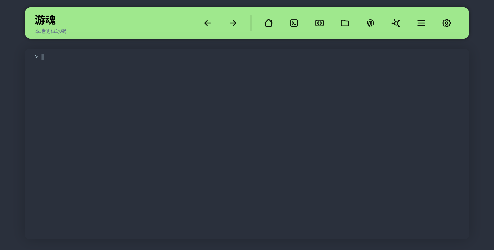

# 游魂

Webshell管理器，开发中

## 预览

### 主页

### 模拟终端

### 文件管理

## 当前功能

- 支持的webshell
  - PHP一句话
  - 冰蝎PHP
- webshell操作
  - 命令执行
  - 文件管理
  - 查看基本信息
  - 下载phpinfo
- webshell编码
  - HTTP参数混淆
  - encoder
  - session暂存payload

## TODO

- 文件管理
  - 输入路径跳转文件夹
  - 下载文件
  - 上传文件
- 开启代理
- 对接蚁剑、冰蝎、哥斯拉
  - [done] 导入冰蝎webshell
  - 导入哥斯拉webshell
  - 以webshell形式对接蚁剑
- 更换字体
