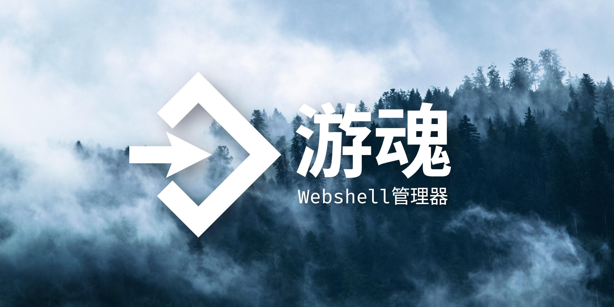
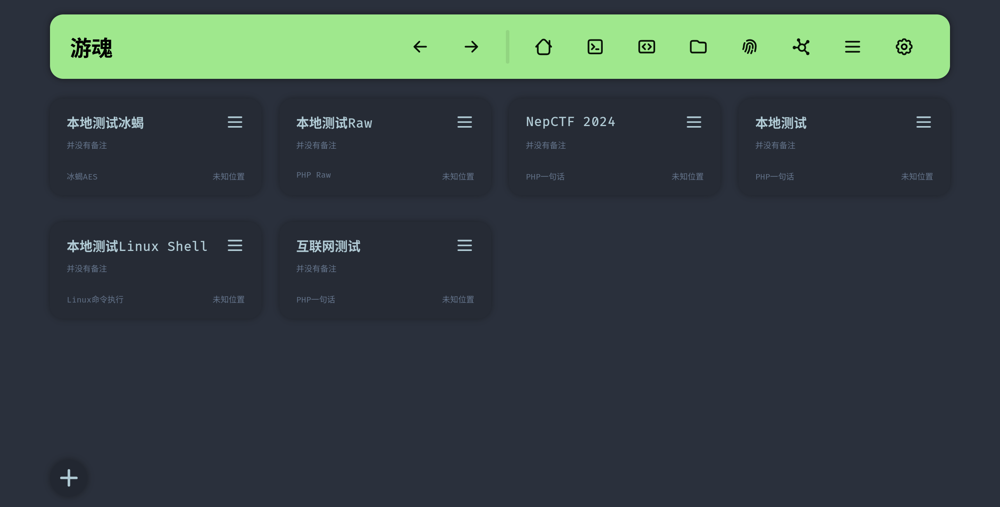

# 游魂



<!-- social preview from https://pixabay.com/photos/fog-forest-conifers-trees-1535201/ -->

[English](./README_en.md) | [文档](./docs.md) | [下载绿色 exe](https://github.com/Marven11/EtherGhost/releases) | [V 我 50](https://github.com/Marven11/Marven11/blob/main/buy_me_a_coffee.md)

游魂是一个开源的 Webshell 管理器，它提供更为方便的界面和更为简单易用的功能，可配合或代替其他 webshell 管理器，帮助用户在各类渗透场景中控制目标机器。

游魂不仅支持常见的一句话 webshell 以及常见 Webshell 管理器的功能，还支持添加冰蝎的 webshell，以及将任何 webshell 提供给蚁剑进行连接的功能。通过使用游魂，用户可以使用蚁剑操控冰蝎 webshell，在冰蝎 webshell 上使用蚁剑的各类插件，同时享受蚁剑的丰富生态以及冰蝎的流量加密和免杀特性。

游魂使用了 B/S 架构，用户可以将游魂架设在服务器上，通过本地浏览器进行连接，彻底移除了本地机器被感染的风险。

游魂自带上手即用 RSA2048+AES256-CBC 强加密，AES 密钥在连接时生成并使用 RSA 加密传输，彻底阻止重放攻击和流量分析。

## 特点

- 同时支持 PHP 一句话 webshell 和冰蝎 PHP/JSP webshell
  - 冰蝎 JSP webshell 仍在测试中
- 流量防重放和流量强加密
- TCP 正向代理
- 异步上传下载文件
- chunked transfer encoding 分块发包
- 对接蚁剑
- 默认使用随机 User Agent
- HTTP 填充垃圾数据
- 自定义 encoder 和 decoder
  - 支持导入部分蚁剑 encoder 和 decoder
- 自定义主题和背景图片（？）
- 。。。。。。

## 预览




## 当前功能

- 支持的 webshell
  - PHP 一句话
  - 冰蝎 PHP
  - 冰蝎 JSP (测试中)
  - Linux 命令
- webshell 操作
  - 命令执行
    - 支持伪终端和普通的命令执行
  - 文件管理
    - 异步文件上传下载
  - PHP 代码执行
  - TCP 正向代理
  - 查看基本信息
  - 下载 phpinfo
- webshell 编码
  - HTTP 参数混淆
  - 蚁剑类 encoder 和 decoder
  - session 暂存 payload
  - 防流量重放
  - RSA+AES 加密

## 安装使用

### Windows - 绿色 exe

到[Release](https://github.com/Marven11/EtherGhost/releases)页面下载绿色 exe 即可

> 绿色 exe 会被 Windows Defender 报毒，虽然我也不知道为什么，但是建议有条件的人使用下面两种方法，直接运行源码或者手动打包 exe

### Windows - 直接运行源码

如果用 pip 那同样是创建 venv 并激活，安装好所有依赖，然后运行`python -m ether_ghost`就行

比如说：

```powershell
python -m venv .venv
. .\.venv\Scripts\Activate.ps1 # 这一步可能会报错
pip install -r requirements.txt
python -m ether_ghost
```

上面第二行命令如果报错“无法加载文件 ... 因为在此系统上禁止运行脚本。”，那需要运行`set-executionpolicy RemoteSigned`解除限制。

如果用 poetry 则直接用 poetry 安装所有的依赖运行`python -m ether_ghost`就行

注意：下载源码的时候还是会被微软报毒，这是因为源码中的测试 webshell 文件被微软检测，可以直接删了整个`test_environment`文件夹，不影响程序运行

### Windows - 手动打包

创建 venv，安装所有依赖，然后查阅[pyinstaller_package.bat](./pyinstaller_package.bat)文件，将里面的虚拟环境路径换成你的`site-packages`文件夹，最后运行即可。

注意：如果之前打包过旧版本的话可能需要重新创建 venv

### Linux - 使用 pip

```shell
pip install ether-ghost
ether_ghost # 启动
# 或者python -m ether_ghost
```

### Linux - 使用 pip+venv

安装并打开：

```shell
cd EtherGhost
python -m venv .venv
. .venv/bin/activate
pip install -r requirements.txt
python -m ether_ghost
```

使用：

```shell
cd EtherGhost
. .venv/bin/activate
python -m ether_ghost
```

### Linux - 使用 poetry

安装并打开：

```shell
cd EtherGhost
poetry install
poetry shell
python -m ether_ghost
```

使用：

```shell
cd EtherGhost
poetry shell
python -m ether_ghost
```

## 为什么不用蚁剑？

我自从学习渗透开始就一直在用蚁剑，蚁剑是一个非常优秀的 webshell 管理器，但是在我想要二开蚁剑的时候才发现蚁剑的架构存在一些问题，无法实现我想要的功能。具体来说：

- 蚁剑基于早已过时的 Electron 4，其 Chromium 内核存在多个安全漏洞，存在被反制的风险。同时 Electron 4 的开发环境难以配置，给二开带来困难。
- 蚁剑的 PHP webshell 不支持 GET 参数传参，在 CTF 环境下较为不便
  - 这里虽然可以在 GET 参数下指定 eval 另一个 POST 参数，但是有这时间填参数为什么不去直接拿 flag？
- 蚁剑使用的 Electron 导致 XSS 漏洞极易被提升为 RCE 漏洞，导致攻击机被反制
- 蚁剑的 encoder 需要经过复杂配置之后才可支持 AES 和 RSA 加密
- 虽然蚁剑可以使用 php_raw 配合 encoder 连接冰蝎 webshell，但蚁剑的插件生态仅支持 php 类型的 webshell，无法在冰蝎 webshell 上使用各类插件

蚁剑的 encoder 生态和插件生态还是很丰富的，encoder 可以通过让 python 调用 nodejs 直接使用，插件移植难度比较大，可以让游魂假装是一个 webshell，接受蚁剑传来的代码就可以解决。

## 为什么不用冰蝎？

冰蝎可以选择 AES CBC 加密或者异或加密，看起来是给 payload 上了强加密，无法被检测。但是异或加密存在一些密码学上的缺陷，导致中间人只要利用异或的一些特性就能直接得到密码，进而解密所有 payload

那 AES CBC 呢？它总该安全了吧？并不，冰蝎在使用 AES CBC 的时候使用了全 0 的 iv, 导致 AES CBC 退化，失去随机性（尤其是前 16 个字节），也存在一些密码学的缺陷，极易被中间人检出。而且冰蝎使用 AES 的缺陷是写死在 webshell 文件中，暂时无法使用其他手段解决的。

如果需要真正的强加密可以考虑在游魂上使用冰蝎的 php webshell, 并打开强加密选项，可以随机化大部分请求的内容，缓解这个问题。

## TODO

- 对接蚁剑、冰蝎、哥斯拉
  - [done] 导入冰蝎 webshell
  - 从哥斯拉的本地数据库导入哥斯拉 webshell
  - 从蚁剑的本地目录导入蚁剑 webshell
  - 从冰蝎的本地目录导入冰蝎 webshell
  - [done] 以 webshell 形式对接蚁剑
- 游魂专用的 webshell 类型
  - 一键生成 webshell
  - padding 功能
  - 流量混淆
    - 4B head 8B xor 密钥 nB 实际的 payload 4B tail
  - 可选生成带公钥的 webshell, 即使有源码也骑不上
- i18n
- 改进文件管理的文件夹管理功能
- 支持冰蝎 4.1 的自定义类型 webshell
- 批量测试 webshell 是否存活
- 数据库连接功能
- 写安装使用的文档，然后把文档分割为多个文件，存到`docs/`里
- 让用户决定是否将 AES 密钥在 session 中持久化，当前审计可以通过提取目标机上的 session 解密流量
- 加密（或者至少混淆的）反弹 Shell
  - 可以用类似 TCP 正向代理的思路搞
  - 或者绑定本地端口等着目标连过来
- [done] 下载 phpinfo
- [done] 显示机器信息
- [done] 真正的正向代理和~~反向代理~~
  - PHP 貌似很难支持绑定本地端口
- [done] pyinstaller 打包，给 windows 用户提供一个绿色的 exe

## 关于流量强加密功能

流量强加密功能一开始是为了 AWD 设计的，主要目标是防止流量重放，以及防止流量分析分析出实际执行的操作。打开流量强加密之后流量分析端理论上能分析出 webshell 的存在，能分析出加解密相关的 PHP 代码，而不能分析出具体执行的命令或代码。

当然流量强加密是存在一些问题的。当前的流量加解密和整个握手功能都需要在目标上执行代码，这个过程对中间人来说是完全透明的。虽然中间人不知道具体执行的代码，但是可以分析出握手时传递的代码，从而查杀 webshell.

当然这个功能是可以改进的。只要把握手过程藏到 webshell 源码里，像冰蝎一样先解密再运行就好了。但是这样的话就需要改进传统一句话木马，也许需要推出游魂特定的 webshell.

目前除了常规功能更新还有增加流量混淆 webshell 的计划，计划是将 webshell 流量伪装成图片上传等流量，可以随着上述功能添加。

## 赞助

这里空空如也

## 免责声明

```
本声明适用于任何使用本工具的个人或组织。在进行任何网络安全活动之前，请仔细阅读并理解以下声明：

1. 目的：本声明的目的是提醒和教育用户，网络安全攻击有潜在违法风险且可能对他人造成损害。通过使用该工具或技术，您确认您已理解并承担使用该工具或技术所带来的一切风险。

2. 合法性：请注意，未经授权的网络安全攻击是违法的，并且可能会导致法律后果。本工具不鼓励或支持任何非法活动。用户需要确保自己的行为符合适用的法律和道德准则。

3. 授权：使用网络安全攻击工具或技术应遵守授权范围以及适用的法律和法规。未经授权的访问或干涉他人的网络、系统或数据是违法的，用户需要获得适当的授权才能进行相关活动。

4. 免责：本工具的源代码完全开源，使用该工具或技术的风险由用户自行承担。对于因使用该工具或技术而产生的任何直接或间接损害，包括但不限于数据丢失、系统瘫痪、法律责任或任何其他损失，我们不承担任何责任。

5. 教育目的：本工具仅供教育和研究目的使用，并且在遵守适用法律和法规的前提下，用于合法的安全测试、渗透测试或其他授权的活动。

6. 共享责任：用户应意识到网络安全是一个共同责任，使用本工具时应始终保证他人的利益和隐私不受损害。

请用户谨慎使用本工具，并确保始终合法、道德和负责任地进行网络安全活动。
```
