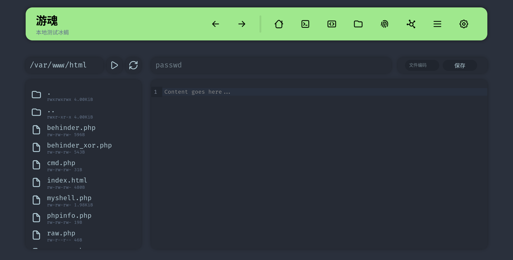

# 鬼刃

Webshell管理器，开发中

## 预览

### 主页

### 模拟终端

### 文件管理

## TODO

- 文件管理
  - 输入路径跳转文件夹
  - 双击打开文件
  - 下载文件
- 开启代理
- 基本信息
- 对接蚁剑、冰蝎、哥斯拉
  - [done] 导入冰蝎webshell
- 改进navbar操作逻辑

## DONE

- HTTP参数的流量混淆
- encoder